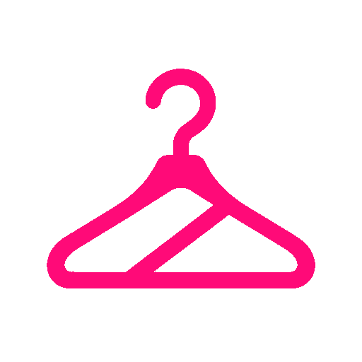
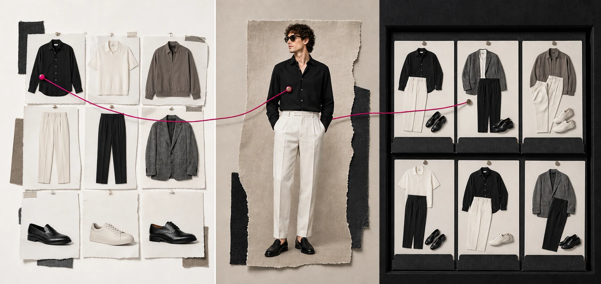
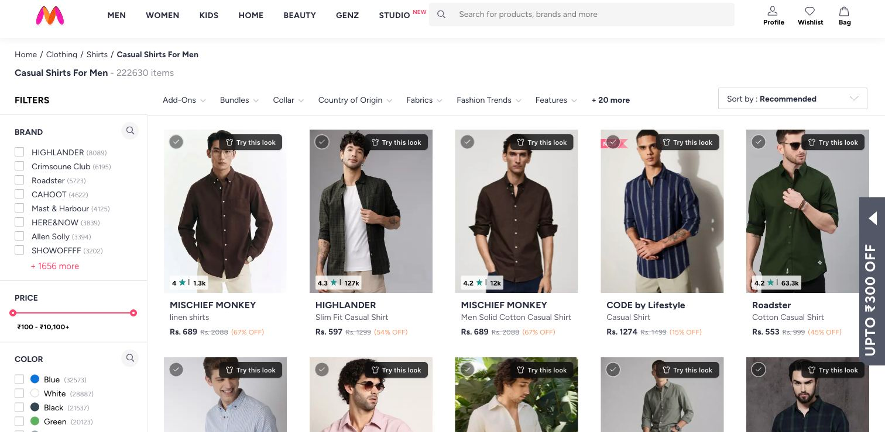
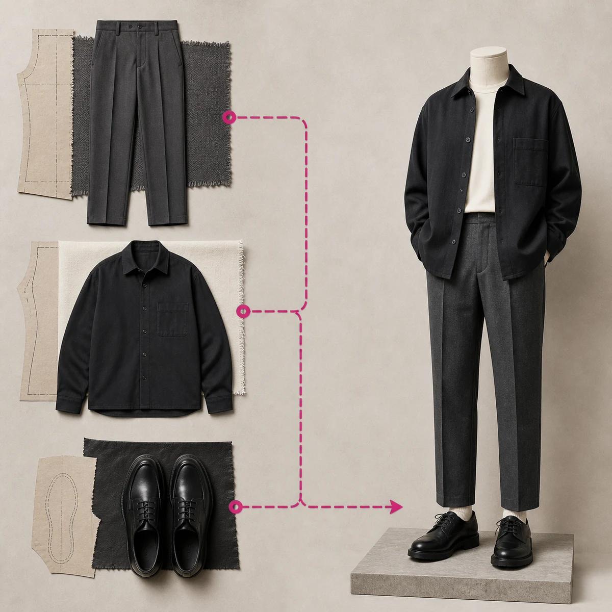
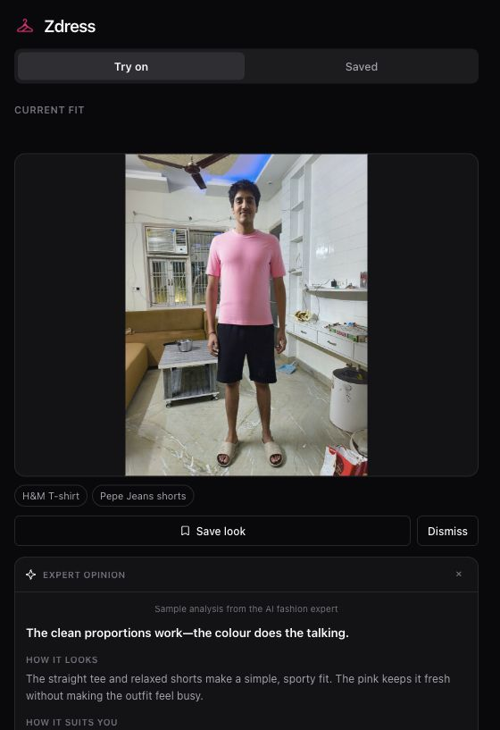
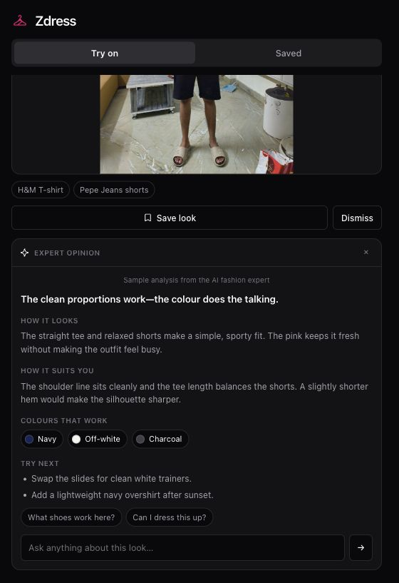
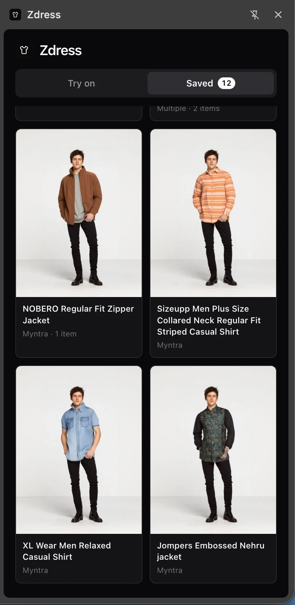
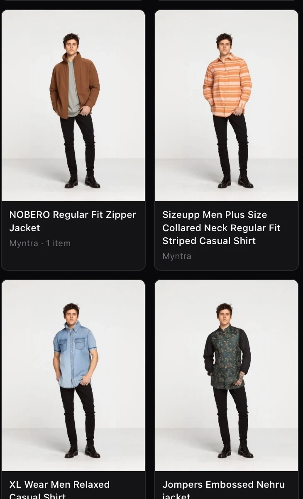
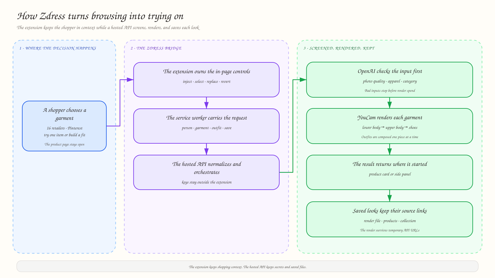

<p align="center">
  
</p>

<h1 align="center">Zdress</h1>

<p align="center"><strong>Virtual try-on where people already shop.</strong></p>

<p align="center">
  A Chrome and Firefox extension built for the YouCam API Hackathon.<br>
  Upload once, try garments inside the retailer grid, assemble a fit across stores, and save every look with its source links.
</p>

## The 30-second judge read

Most virtual try-on demos ask shoppers to leave the store, upload a photo, and paste a product image into another tool. Zdress moves the experience into the shopping page instead.

- **In-place try-on:** each product card gets a **Try this look** control and the result replaces that card's image.
- **Cross-store outfits:** select a top on one site and trousers on another, then render them as one fit.
- **Persistent collections:** save the generated image and the original product links, so every item can be referenced or reopened later.
- **Input quality gates:** unsuitable photos and non-apparel images are rejected before a YouCam render is spent.
- **Pinterest source integrity:** moodboards are split into their visible garments without inventing missing pieces.

Adapters cover 16 fashion retailers plus Pinterest, including Myntra, AJIO, Flipkart, Amazon, Nykaa Fashion, ASOS, H&M, Zalando, Abercrombie and Hollister.



## Product demo

### Try on products without leaving the grid

The extension injects controls into the retailer's own cards. The shopper keeps the page, comparison set, price, and product context in view while trying on multiple items.



### Build one look across multiple stores

Selections live in extension storage instead of the current webpage. A shopper can pick pieces from different retailers and render them in a safe layer order: lower body, upper body, then shoes.

<p align="center">
  
</p>

### Ask the AI fashion expert

The expert analyzes the generated try-on rather than the catalogue model. It gives a concise read on silhouette and proportion, suggests useful colour pairings, and keeps the conversation open for follow-up questions.

<p align="center">
  
  &nbsp;&nbsp;
  
</p>

### Save collections and keep the shopping trail

YouCam result URLs are temporary, so Zdress stores the image file locally. Every saved look also keeps its source products and links; shoppers can open those listings again whenever they revisit the collection.

<p align="center">
  
  &nbsp;&nbsp;
  
</p>

## How it works



1. A site adapter finds stable product cards, images, titles, and links.
2. The content script mounts try-on and outfit-selection controls without taking over the page.
3. The extension service worker sends the person and garment context to the local API.
4. OpenAI vision checks the photo, rejects unusable inputs, and determines the garment category.
5. YouCam Apparel Virtual Try-On renders one garment at a time.
6. The result returns to the original card or side panel, where it can be reverted, discussed, or saved.
7. Saved renders and product references are written to a local library rather than left on expiring API URLs.

## What makes the implementation different

### Retailer-aware, not retailer-shaped

All site-specific logic lives in `apps/extension/shared/sites.js`. The main content script only knows the common adapter contract. Selectors prefer product structure, CDN patterns, and URL slugs over build-hashed CSS classes that change on retailer deploys.

### One photo, many decisions

The person image is uploaded once and reused for later try-ons. Product clicks resolve lazy-loaded images at interaction time, which is necessary on grids such as Myntra where off-screen cards do not yet contain their final image.

### Multi-garment rendering with explicit rules

The YouCam cloth endpoint accepts one garment per task. Zdress composes an outfit by feeding each completed render into the next task. Slot conflicts and full-body garments are resolved before rendering so incompatible picks do not silently produce a broken fit.

### Source-faithful Pinterest looks

A worn outfit can be rendered directly. A flat-lay or moodboard is different: Zdress locates the visible wearable pieces, crops those source pixels with Sharp, screens each crop, and then reuses the normal outfit pipeline. Bags, caps, and unsupported pieces are skipped instead of fabricated.

### Secrets stay outside the extension

YouCam and OpenAI keys exist only in the local Express API. The browser extension talks to `localhost:3000`; no API secret is shipped in an unpacked extension where it could be extracted.

## Repository structure

```text
dressup/
├── apps/
│   ├── api/                 # Express API, image checks, YouCam orchestration, saved library
│   │   ├── src/
│   │   └── tools/           # focused evaluation and conversion scripts
│   ├── extension/           # one shared extension source, two browser manifests
│   │   ├── chrome/
│   │   ├── firefox/
│   │   ├── shared/
│   │   └── scripts/build.mjs
│   └── web/                 # Next.js hackathon landing page and product evidence
├── docs/graphs/             # source spec and rendered architecture graph
├── DEVPOST.md               # longer submission notes and measured implementation details
└── package.json             # root commands only; each app owns its dependencies
```

Each deployable unit keeps its own package manifest and lockfile. The root package is intentionally only an orchestrator, which keeps extension packaging, API dependencies, and the Next.js toolchain independent.

## Stack

| Layer | Technology | Responsibility |
| --- | --- | --- |
| Browser integration | Manifest V3, WebExtensions APIs | Site adapters, in-page controls, side panel, cross-site selection |
| Rendering API | YouCam Apparel Virtual Try-On | Single-garment renders composed into complete outfits |
| Vision and styling | OpenAI SDK | Photo validation, garment screening, collage analysis, expert opinion |
| Local backend | Node.js, Express, Sharp | Secret boundary, normalization, orchestration, durable image storage |
| Landing page | Next.js, React, Tailwind CSS, Motion | Judge-facing demo, product screenshots, technical story |

## Run it locally

### Prerequisites

- Node.js 20 or newer
- Chrome or Firefox
- A YouCam API key
- An OpenAI API key

### 1. Set up

```bash
git clone https://github.com/vimzh/dressup.git
cd dressup
npm run setup
```

`setup` installs both apps, creates `apps/api/.env` from the example, and builds
the extension for Chrome and Firefox. It is safe to re-run — every step is a
no-op once done. The extension build uses Node's standard library only and has
no install step of its own.

### 2. Add your keys and start

Put `YOUCAM_API_KEY` and `OPENAI_API_KEY` into `apps/api/.env`, then:

```bash
npm run dev
```

That runs the API on **:3000** and the landing page on **:3001** under a single
Ctrl-C. Port 3000 is not configurable: the extension ships
`API_BASE = 'http://localhost:3000'`, so `dev` refuses to start rather than move
the API somewhere the extension will never look.

Stuck? `npm run doctor` checks Node, installs, keys, both extension builds and
the live API in one pass, and prints the fix for whatever it finds. It never
prints key values, only whether they are set.

```bash
npm run doctor
```

### 3. Fastest macOS install

Download [`zdress-installer-macos.zip`](apps/web/public/downloads/zdress-installer-macos.zip), unzip it, and open `install-zdress.command`.

Or paste this into Terminal:

```bash
curl -fsSL https://raw.githubusercontent.com/vimzh/dressup/main/apps/web/public/downloads/install-zdress.command -o /tmp/install-zdress.command && bash /tmp/install-zdress.command
```

The installer downloads and unpacks Zdress, opens `chrome://extensions`, reveals the extension folder, and copies its path. Stable Chrome still requires the final **Load unpacked** approval; Chrome no longer permits scripts to silently install an unpacked extension.

### 4. Build and load the extension manually

```bash
npm run build:extension
```

Chrome:

1. Open `chrome://extensions`.
2. Enable **Developer mode**.
3. Choose **Load unpacked** and select `apps/extension/dist/chrome`.

Firefox:

1. Open `about:debugging#/runtime/this-firefox`.
2. Choose **Load Temporary Add-on**.
3. Select `apps/extension/dist/firefox/manifest.json`.

Upload a clear, front-facing photo from the Zdress side panel, then open a supported retailer and choose **Try this look**.

### 5. Run the landing page

`npm run dev` already serves it on `http://localhost:3001`. To run it alone:

```bash
npm run dev:web
```

## Useful commands

```bash
npm run setup            # install both apps, seed .env, build the extension
npm run doctor           # diagnose Node, installs, keys, dist/, live API
npm run dev              # API :3000 + web :3001, one Ctrl-C for both
npm run dev:api          # local Express API with watch mode
npm run dev:web          # Next.js development server alone
npm run build            # extension bundles + production web build
npm run lint             # web ESLint + Firefox extension lint
npm run package          # distributable Chrome and Firefox archives
```

`WEB_PORT=4000 npm run dev` moves the web app; the API stays on 3000.

## Current hackathon boundaries

- The API and saved library run locally; this is not a hosted multi-user service.
- Retailer DOM changes can require an adapter update.
- Rendering latency and usage depend on the external YouCam API and the number of selected garments.
- Firefox cannot always open its sidebar programmatically after a message crosses extension contexts; the result is still saved for the next manual sidebar open.

## Built for the YouCam API Hackathon

Zdress treats try-on as part of shopping rather than a destination beside it. The working prototype joins retailer browsing, input screening, multi-piece rendering, source-faithful Pinterest handling, stylist feedback, and a durable saved library in one browser workflow.

See [`DEVPOST.md`](DEVPOST.md) for the detailed implementation narrative and measured experiments.
