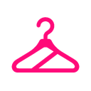

<p align="center">
  
</p>

# Zdress browser extension

The Chrome and Firefox client for Zdress. It adds virtual try-on controls to supported fashion sites, keeps cross-store outfit selections in extension storage, shows results in a side panel, and preserves every saved look with its original product links.

## Structure

```text
apps/extension/
├── chrome/manifest.json       # Chrome-only permissions and side panel config
├── firefox/manifest.json      # Firefox sidebar and Gecko metadata
├── shared/
│   ├── background.js          # calls the local API and manages browser-level state
│   ├── content.js             # injects controls and mounts results on retailer pages
│   ├── content.css            # retailer-safe extension styles
│   ├── sidepanel.html/js      # photo, outfit, stylist, and saved collection UI
│   ├── sites.js               # retailer adapter registry
│   └── icons/                 # shared Zdress mark
├── scripts/build.mjs          # merges shared files with each browser manifest
└── dist/                      # generated unpacked builds and release archives
```

## Build

From the repository root:

```bash
npm run build:extension
```

The outputs are:

- `apps/extension/dist/chrome`
- `apps/extension/dist/firefox`

Use `npm run package` to create distributable archives.

## Load locally

Chrome: open `chrome://extensions`, enable **Developer mode**, choose **Load unpacked**, and select `dist/chrome`.

Firefox: open `about:debugging#/runtime/this-firefox`, choose **Load Temporary Add-on**, and select `dist/firefox/manifest.json`.

The local API must be running at `http://localhost:3000`. See the [project README](../../README.md) for setup and architecture.
